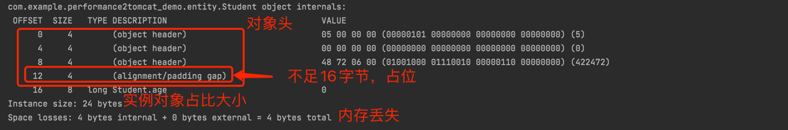

# tomcat的性能调优实战
**流程**
1. 编写一个`springboot`项目，开放接口访问；每次接口访问，生成固定大小的对象，模拟生产环境中线程栈中的对象；（使用jol来预估对象大小）
   
2. 编写`dockerFile`，打包好镜像，启动容器的时候，设置CPU核数和容器内存大小
3. 修改`springboot`内置的`tomcat`jar包的配置(`org.springframework.boot.autoconfigure.web.Tomcat`)，使用jmeter工具进行压测
```
系统最大可创建的线程数量=(机器本身可用内存 - (JVM分配的堆内存+JVM元数据区)) / Xss的值
机器本身可用内存 = 机器总内存 - 在未运行java项目时的内存
线程数的经验值为： 1 核2g内存 ，线程数经验值 200 ； 4 核8g内存，线程数经验值 1000 。
```

## springboot测试项目
maven添加dockerfile插件, `https://github.com/spotify/dockerfile-maven`
```xml
			<plugin>
                <groupId>com.spotify</groupId>
                <artifactId>dockerfile-maven-plugin</artifactId>
                <version>1.4.13</version>
                <configuration>
					<!--dockerfile:tag的时候需要-->
                   <repository>ljh/performance-tomcat</repository>
					<tag>version-${project.version}</tag>

                   <!--指定dockerfile文件-->
                   <dockerfile>./Dockerfile</dockerfile>
				</configuration>
            </plugin>
```

**启动参数**

## 构建docker镜像
1. 编写dockerfile
2. package项目，在target目录下生成jar包
3. 执行`mvn clean package dockerfile:build`打包镜像
4. 执行`mvn clean package dockerfile:tag`给镜像打标签
   结果：
      镜像文件：`target/performance2tomcat_demo-0.0.1-SNAPSHOT-docker-info.jar`
      本地docker: 已经有打包好的镜像
5. 执行命令启动容器
```shell
## 限制参数
### 系统：CPU、运行内存[、软限制内存（主机内存不足时激活，--memory-reservation=256m）]
### JVM: 堆大小、栈大小、元空间大小
### Tomcat启动的初始内存其初始空间(即-Xms)默认值是物理内存的1/64。最大空间(-Xmx)默认值是物理内存的1/4。（http://t.zoukankan.com/jpfss-p-11087057.html）
### 公式：主机内存 >= 其他进程（非Java）运行内存 + （堆最大内存 + 元空间 + 单条线程栈最大占用内存 * tomcat线程数）

# 1CPU 2G tomcat 1000，参考https://www.cnblogs.com/ailuo9494/p/16021679.html
docker run -d --name tomcat_1cpu_2g_1000 --cpus=1 -m 2g -p 8081:8081 -e "tomcatSeverPort=8081" -e "maxTomcatAcceptCount=100" -e "maxTomcatThreadNum=1000" -e "JAVA_OPTS=-server -XX:+PrintGC -XX:+PrintGCDetails -Xmx512m -Xmn256m -Xms256m -Xss256k" ljh/performance-tomcat:version-0.0.1-SNAPSHOT
# 1CPU 2G tomcat 2000，参考https://www.cnblogs.com/ailuo9494/p/16021679.html
docker run -d --name tomcat_1cpu_2g_2000 --cpus=1 -m 2g -p 8082:8082 -e "tomcatSeverPort=8082" -e "maxTomcatAcceptCount=100" -e "maxTomcatThreadNum=2000" -e "JAVA_OPTS=-server -XX:+PrintGC -XX:+PrintGCDetails -Xmx512m -Xmn256m -Xms256m -Xss256k" ljh/performance-tomcat:version-0.0.1-SNAPSHOT
```

## jmeter测试
tomcat默认最大线程数为200，通过参数调整
**进入容器**
`docker exec -it 容器id /bin/sh`
**查看主机中所有进程的内存使用情况**
```shell
# top -m
Mem total:2036732 anon:745976 map:165320 free:636696
 slab:62160 buf:15120 cache:532536 dirty:20 write:0
Swap total:1048572 free:979164
  PID^^^VSZ^VSZRW   RSS(物理内存/运行内存) (SHR) DIRTY (SHR) STACK COMMAND
    1 2341m  668m  243m   532  231m     0   132 java -server -XX:+PrintGC -XX:+PrintGCDetails -Xmx1g -Xms512m -Xss256k -jar app.jar sh
   32  1664   228  1132   888   184     0   132 /bin/sh
   46  1600   164   948   880    60     0   132 top -m

# 计算公式(待验证)：（RSS * 1024 + free - Xmx - 元数据区大小）/ Xss
```

## 附录
### 影响tomcat吞吐量的因素
- 网络：三方接口或请求响应体过大导致的时延问题，线程不能很快结束
- 网络：TCP连接的Time_wait过多
- JVM：Full GC频繁，GC的STW，会停止所有线程执行
- TomCat：性能过剩，但是tomcat限制了请求流量，maxThreads可以进行适当调整