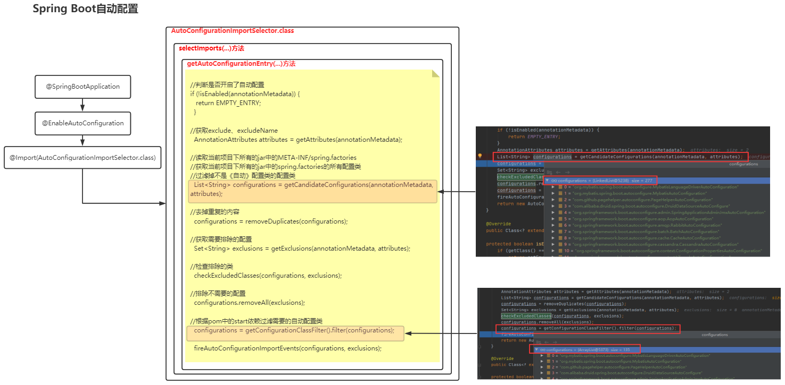
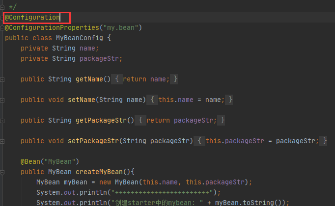
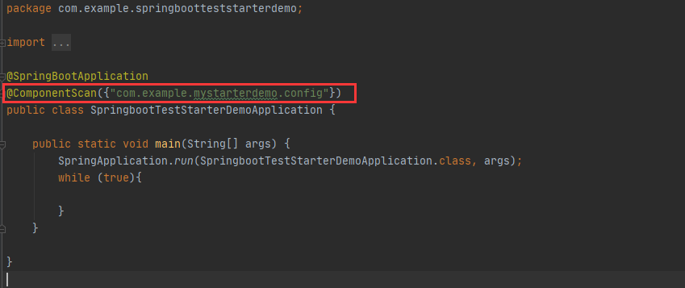
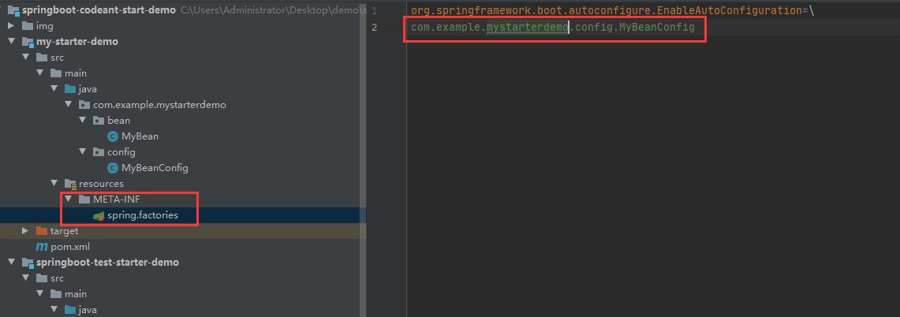
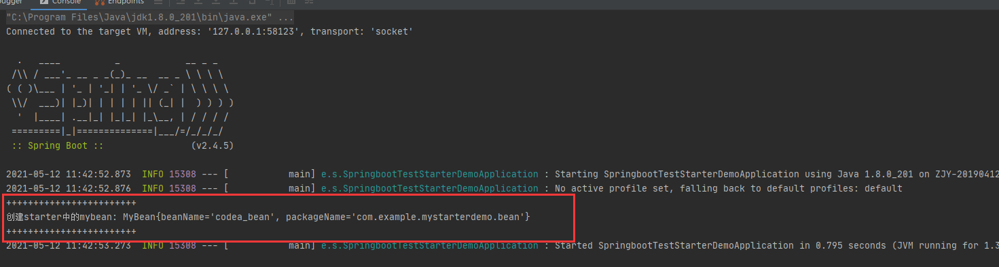

## springboot自动配置原理（制作自己的starter）

> 原图：https://www.processon.com/diagraming/60740a831e085335c2baf484

### 1. 自动配置的流程

>

### 2. @Configuration和spring.factories的区别

> 两者都能够将bean注入容器
>
> **利用注解方式：**@Configuration的耦合性更高(需要在使用方配置扫描路径)
>
> **利用springboot自动装配：**采用spring.factories的方式来进行自动配置

#### 2.1 @Configuration

> 项目地址：
>
> 众所周知，spring的注解（@Service,@Controller,@Compoment,@bean,@Configuration）一系列注解都是将bean注入到容器。具体流程是：
>
> **创建java类 -> 标识注解 -> 扫描标识注解 ->将扫描的类注入容器**

> 
>
> 

#### 2.2 spring.factories

> 项目地址：
>
> 利用springboot自动装配的原理，他会导入项目下所有jar包中MTE-INF/spring.factories中的自动配置类

> 

### 3. 成功截图

> 