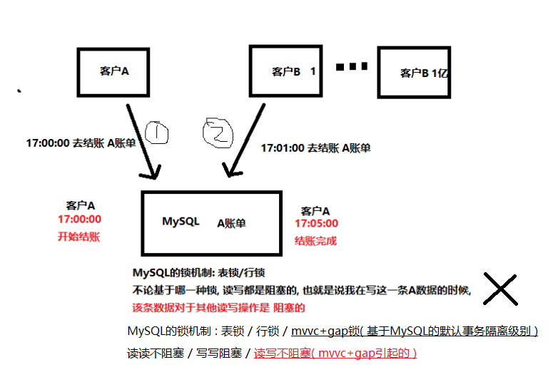
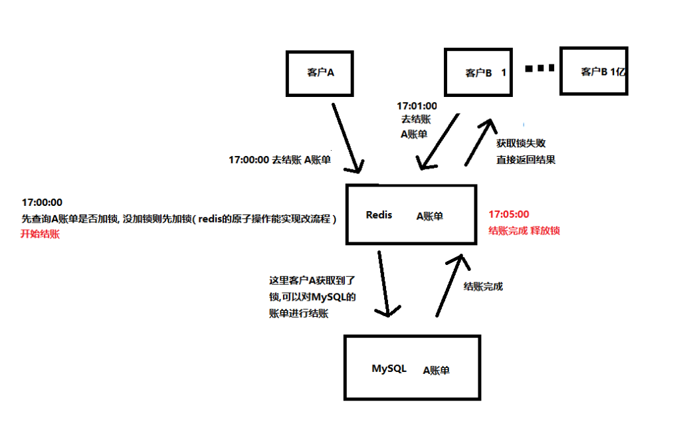
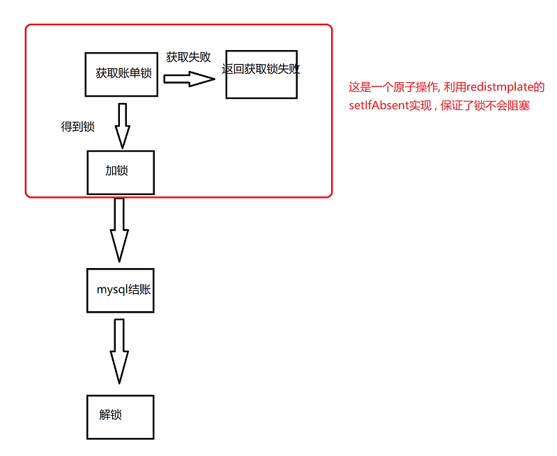

# Redis分布式锁 -- 账单结账

## 前提

> 如果你对redis的CRUD操作还不是很熟悉, 可以去阅读[springboot_redis_demo](https://github.com/LiJinHongPassion/springboot/tree/master/springboot-redis-demo)：springboot整合redis数据库利用redistemplate实现CRUD

> 该篇文章主要是对结账中单台redis分布式锁介绍 , 代码也仅仅实现了单台redis的情况

---

## 准备

> **环境: **redis集群( redis相互之间没有任何通信 ), mysql, jdk

---

## 说明

在基于redis的incr的秒杀demo中提到的问题 : 

> 多个线程同时修改同一条数据 , MySQL和Redis怎么保证不会出现线程安全

得出的结论就是在redis中, 原子操作是保证线程安全基本条件。

---

## 场景分析

> 用户A 在 17:00:00 去结账 A账单, 在 17:05:00 结账完成
>
> 期间用户B...B1亿 在17:01:00 去结账 A账单

**问题**

- 用户B...B1亿阻塞时间**至少**长达4分钟( 为什么是至少? 因为用户A结账失败, 用户B1写操作, 其他用户同样会继续阻塞 )
- 当阻塞的数量过大, MySQL数据库压力就特别大, 严重会导致宕机。

---

## 处理方案

#### redis单例

> 利用redis的分布式锁
>
> 在redis压力不是特别大的情况下 , 该种设计可以适用

**为什么选择redis ?**

>1. redis是单线程的, 基于内存的操作, redis的QPS能达到10W, 也就是说1亿个请求要花1000s。在此还可以通过集群啥的扩充redis的QPS。
>2. redis是不加锁的

 **为什么选择redis的分布式锁 ?**

> redis是不加锁的

**加锁会不会导致类似MySQL一样的阻塞 ? **

> **不会** , redistemplate的setIfAbsent()是一个原子操作 , 当获取锁失败就会立即返回失败的信息 , 不会像**自旋锁**那样一直循环等待获取锁。
>
> 

**如果获取锁失败 , 我不想立即返回信息 , 还想再尝试获取几次 , 怎么办 ?**

> 有时候业务需要我们获取锁失败后 , 不要立即返回 , 而是在多尝试几次再去获取锁 , 这里我们就**可以添加一个延时重试**。

**TomCat服务器宕机 ? **

> 但是有种情况就是一个用户获取到锁了 , 然后突然**tomcat服务器宕机**了 , unlock操作不会执行，所以这个锁不会被释放，其他机器拿不到锁，从而形成了死锁。**为了避免死锁形成 , 可以在锁上添加一个过期时间**

---

#### 多台redis - redLock

**一台Redis的情况下, 假如这台Redis服务器宕机了 ? **

> **redis 挂了怎么办呢？**假如一个客户端已经获取到了锁，这个时候redis挂了（假如是redis集群），其他的redis服务器会接着提供服务，这个时候其他客户端可以在新的服务器上获取到锁了，这也导致了锁意义的丢失。有兴趣的同学可以去看看[RedLock](http://www.redis.cn/topics/distlock.html)，这种方案以牺牲性能的代价解决了这个问题。

---

## 参考文献

> 阅读顺序
>
> 1. [Redis分布式锁官方文档](http://www.redis.cn/topics/distlock.html)
> 2. [Redis实现分布式锁](https://zhuanlan.zhihu.com/p/73807097)
> 3. [Redisson中文官方文档]([https://github.com/redisson/redisson/wiki/%E7%9B%AE%E5%BD%95](https://github.com/redisson/redisson/wiki/目录))
> 4. [redis如何设计秒杀](https://blog.csdn.net/shendl/article/details/51092916?utm_medium=distribute.pc_relevant_t0.none-task-blog-BlogCommendFromMachineLearnPai2-1.nonecase&depth_1-utm_source=distribute.pc_relevant_t0.none-task-blog-BlogCommendFromMachineLearnPai2-1.nonecase)
> 5. [redis分布式锁](https://www.cnblogs.com/jiawen010/articles/11350125.html)