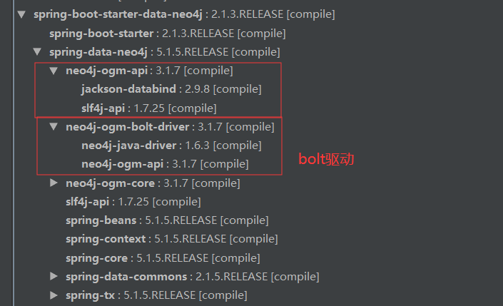

## 1. 简述

**SDN官方文档：** https://docs.spring.io/spring-data/neo4j/docs/5.2.1.RELEASE/reference/html/#reference
**demo：** https://github.com/LiJinHongPassion/springboot/tree/master/springboot_neo4j_example-master

#### 1.1 概述

对于neo4j图数据库不了解拿来干嘛的，建议阅读下面两篇文章

[读书笔记-Neo4j实战之Neo4j概述]( https://lijinhongpassion.github.io/codeant/neo4j1.html )
[读书笔记-Neo4j实战之入门案例理解neo4j]( https://lijinhongpassion.github.io/codeant/neo4j2.html )

#### 1.2 安装

##### 1.2.1 windows

**镜像下载：** http://we-yun.com/index.php/blog/releases-56.html（因为官网下载太慢）
**安装教程：** https://blog.csdn.net/huanxuwu/article/details/80785986

**启动：** `neo4j.bat console`

##### 1.2.2 centos

采用docker安装
```shell
docker pull neo4j
docker run -it -d -p 7474:7474 -p 7687:7687 neo4j:latest
```

#### 1.3 可视化工具

可视化工具有几种，这里采用浏览器可视化工具，启动neo4j后，访问`http://localhost:7474`，初始账户`neo4j`密码为`neo4j`

#### 1.4 CQL(必学)

建议学习书籍：https://gitee.com/LiJinHongPassion/utils-studyDoc/blob/master/%E5%AD%A6%E4%B9%A0%E6%96%87%E6%A1%A3/neo4j/Neo4j%E5%AE%9E%E6%88%98%20(%E6%95%B0%E6%8D%AE%E5%BA%93%E6%8A%80%E6%9C%AF%E4%B8%9B%E4%B9%A6)_201604.pdf

学习地址： https://www.w3cschool.cn/neo4j/neo4j_cql_introduction.html ，在后面的@Query中使用，类似于sql

学习笔记：

## 2. Java开发入门

采用SDN来操作neo4j，但是处理数量级10000以上，需要使用neo4j原生api

**SND架构**


#### 2.1 环境以及依赖版本

| 名称                   | 版本  |
| ---------------------- | ----- |
| neo4j社区版服务器      | 3.5   |
| SDN(spring data neo4j) | 2.1.3 |

**POM**

```xml
<parent>
    <groupId>org.springframework.boot</groupId>
    <artifactId>spring-boot-starter-parent</artifactId>
    <version>2.1.3.RELEASE</version>
</parent>

<dependencies>
    <dependency>
        <groupId>org.springframework.boot</groupId>
        <artifactId>spring-boot-starter-web</artifactId>
    </dependency>
    <!--neo4j  -  包含bolt驱动-->
    <dependency>
        <groupId>org.springframework.boot</groupId>
        <artifactId>spring-boot-starter-data-neo4j</artifactId>
    </dependency>

    <!--lombok-->
    <dependency>
        <groupId>org.projectlombok</groupId>
        <artifactId>lombok</artifactId>
        <optional>true</optional>
    </dependency>
</dependencies>
```

这里看一下SDN里面有些什么子依赖包：



#### 2.2 配置（conf）

**参考文档：** https://docs.spring.io/spring-data/neo4j/docs/5.2.1.RELEASE/reference/html/#reference.getting_started.spring-configuration 

**application.properties**

```properties
# 配置链接neo4j，这里使用的是bolt驱动
spring.data.neo4j.username=neo4j
spring.data.neo4j.password=codeant
#spring.data.neo4j.uri=bolt://116.62.48.220:7687
spring.data.neo4j.uri=bolt://127.0.0.1:7687
```

**Neo4jConfig.java**

```java
import org.neo4j.driver.v1.AuthTokens;
import org.neo4j.driver.v1.Driver;
import org.neo4j.driver.v1.GraphDatabase;
import org.neo4j.ogm.session.SessionFactory;
import org.springframework.beans.factory.annotation.Value;
import org.springframework.boot.autoconfigure.domain.EntityScan;
import org.springframework.context.annotation.Bean;
import org.springframework.context.annotation.Configuration;
import org.springframework.data.neo4j.repository.config.EnableNeo4jRepositories;
import org.springframework.data.neo4j.transaction.Neo4jTransactionManager;
import org.springframework.transaction.PlatformTransactionManager;
import org.springframework.transaction.annotation.EnableTransactionManagement;
import javax.annotation.Resource;

//文档介绍：https://docs.spring.io/spring-data/neo4j/docs/5.2.1.RELEASE/reference/html/#reference.getting_started.spring-configuration
@Configuration
@EnableNeo4jRepositories(basePackages = "org.neo4jdemo.repository")//扫描dao
@EnableTransactionManagement//开启事务，在neo4j的service上可以使用@Transactional支持注解
@EntityScan(basePackages = {"org.neo4jdemo.model"})//扫描entity，在neo4j中叫domain
public class Neo4jConfig {

    @Value("${spring.data.neo4j.uri}") private String uri;
    @Value("${spring.data.neo4j.username}") private String username;
    @Value("${spring.data.neo4j.password}") private String password;

    @Resource private SessionFactory sessionFactory;

    @Bean
    public Driver getCypherDriver() {
        return GraphDatabase.driver(uri, AuthTokens.basic(username, password));
    }

    /**
     * 描述:配置支持事务
     * @author LJH-1755497577 2019/11/14 13:32
     */
    @Bean("transactionManager")
    public PlatformTransactionManager neo4jTransactionManager() {
        return new Neo4jTransactionManager(sessionFactory);
    }
}
```

#### 2.3 创建实体类（model）

##### 2.3.1 创建节点并为节点添加属性


##### 2.3.2 创建关系并为关系添加属性


#### 2.3 dao层（Repository）

1. dao层接口继承Neo4jRepository，就自带crud

```java
/**
 * 描述：Movie的dao层，继承Neo4jRepository，就自带crud
 *
 * @author LJH
 * @date 2019/11/14-14:37
 * @QQ 1755497577
 */
public interface MovieRepository extends Neo4jRepository<Movie, Long> {
}
```
2. 查询返回复杂实体类
@QueryResult注解
```java
@Getter
@Setter
@NoArgsConstructor
@QueryResult
public class PersonMovie {
    private Person person;

    private Set<Movie> movies;
}
使用PersonMovie
public interface PersonRepository extends Neo4jRepository<Person, Long> {

    @Query("MATCH (person:Person {name: {name}})-[r:ACTED_IN]->(movie) RETURN person,collect(movie) as movies")
    List<PersonMovie> getPersonMoviesbyName(@Param("name") String name);
}

```


#### 2.4 service层(Service)

#### 2.5 controller层（Controller）

## 3. 注解讲解

参考文档： https://docs.spring.io/spring-data/neo4j/docs/current/reference/html/#reference:annotating-entities 

#### @NodeEntity 

```java
@NodeEntity(label = "Movie") public class Movie {
```

 定义节点实体，使用`Spring Data Neo4j`的注解`@NodeEntity`，给节点**打标签**，标签名称为 `类名` 

---

#### @RelationshipEntity

```java
@RelationshipEntity(type = "ACTED_IN") public class ActIn {
```

 定义关系实体，使用`Spring Data Neo4j`的注解`@RelationshipEntity`，给关系**分类型**，类型名称为 `类名` 

---

#### @Relationship

```java
@Relationship(direction = Relationship.INCOMING, type = "ACTED_IN") private Set<ActIn> actIns;
```

direction ：关系方向。incoming表示	，outcoming表示	， UNDIRECTED 表示没有方向

type ：关系类型

```java
//也就是演员指向电影
@Relationship(type = “DIRECTED”, direction = Relationship.OUTGOING)
private List dMovies;

表示演员到movie存在一条关系，就是person会指向movie，我们没有在关系上添加属性，可以在以后的例子中再扩展成，分别担任什么角色，或者是主导演还是副导演等等
```

---

#### @Id & @GeneratedValue


---

#### @Property

```java
@NodeEntity(label = "Movie")
public class Movie {
    @Id @GeneratedValue private Long id;

    @Property private int released;
```

**节点**或者**关系**的属性

---

#### @StartNode & @EndNode

您必须在关系实体类中包含@RelationshipEntity加上一个@StartNode字段和一个@EndNode字段，否则在读取或写入时，OGM将抛出一个MappingException。不可能在非注释的域模型中使用关系实体。 

```java
@NodeEntity
public class Actor {
    Long id;
    @Relationship(type="PLAYED_IN") private Role playedIn;
}

@RelationshipEntity(type = "PLAYED_IN")
public class Role {
    @Id @GeneratedValue   private Long relationshipId;
    @Property  private String title;
    @StartNode private Actor actor;
    @EndNode   private Movie movie;
}

@NodeEntity
public class Movie {
    private Long id;
    private String title;
}
```

---

####  @Query

 `@Query`注释可以提供使用Cypher图查询语言的查询。 

```java
@Query("MATCH (:Actor {name:{name}})-[:ACTED_IN]->(m:Movie) return m")
```

---

####  @Depth

---

####  @QueryResult 

 带`@QueryResult`注释的类的属性必须与返回的值具有相同的名称。请记住，Java和Cypher区分大小写 

```java
public interface MovieRepository extends Neo4jRepository<Movie, Long> {

    @Query("MATCH (movie:Movie)-[r:RATING]->(), (movie)<-[:ACTS_IN]-(actor:Actor) " +
           "WHERE movie.id={0} " +
           "RETURN movie as movie, COLLECT(actor) AS cast, AVG(r.stars) AS averageRating")
    MovieData getMovieData(String movieId);
}


@QueryResult
public class MovieData {
    Movie movie;
    Double averageRating;
    Set<Actor> cast;
}
```

---

## 扩展

d3.js前端导图： https://blog.csdn.net/qq_34414916/article/details/80026029 