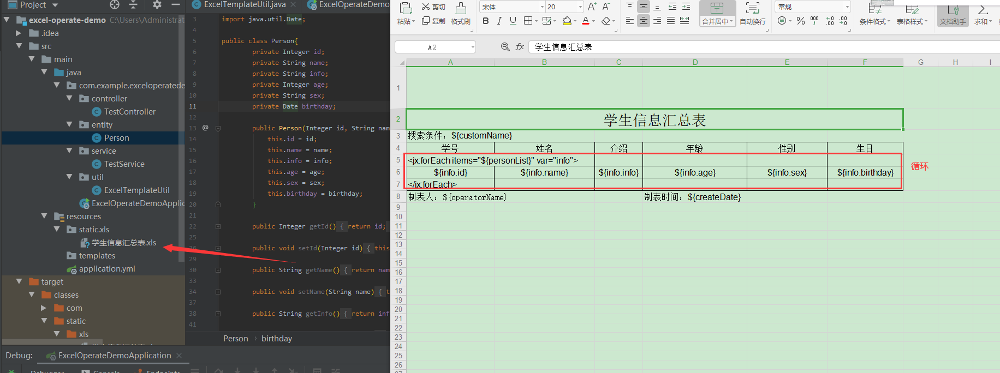
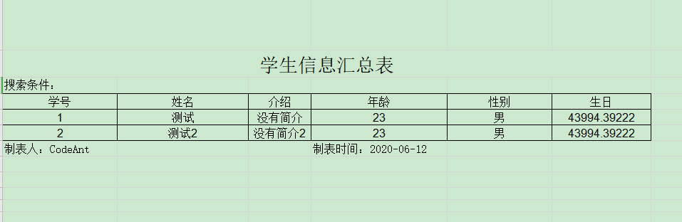
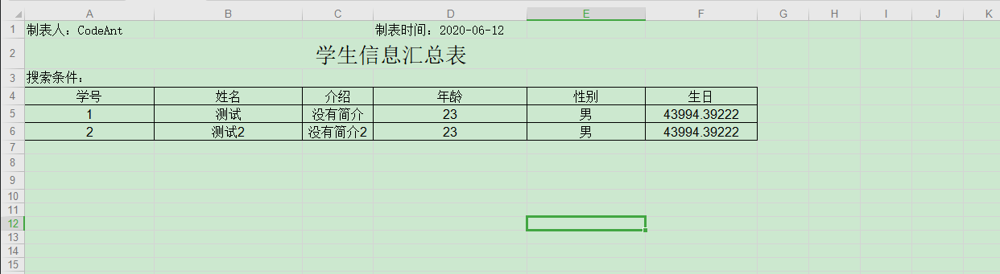
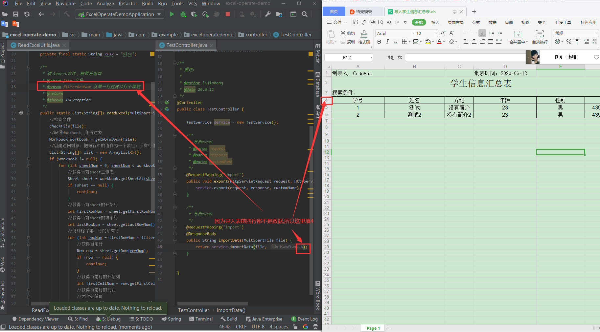

[toc]

## 简介

> 该项目是对excel的导出和导入的实操, **注意是纯文本的导入导出**
>
> Github : https://github.com/LiJinHongPassion/springboot/tree/master/springboot_poi_excel-operate-demo

## 1 相关依赖

```xml
    <!-- excel操作包 -->
    <dependency>
        <groupId>org.apache.poi</groupId>
        <artifactId>poi</artifactId>
        <version>3.9</version>
    </dependency>
    <dependency>
        <groupId>net.sf.jxls</groupId>
        <artifactId>jxls-core</artifactId>
        <version>1.0.3</version>
    </dependency>
    <!-- excel操作包 -->
```
## 2 Excel导出

### 1 创建.xls模板



### 2 ecxel工具类

```java
/**
 * excel工具类，通过excel模板文件自动生成excel文件
 *
 */
public class ExcelTemplateUtil {

    /**
     *
     * @param templatePath excel模板文件位置
     * @param fileName 导出excel的文件名
     * @param model 数据
     * @param response 请求进来的response,通过改写header,直接返回文件流进行下载
     * @throws Exception
     */
    public static void parse(String templatePath, String fileName, Map<String, Object> model, HttpServletResponse response) throws Exception {
        try (FileInputStream inputStream = new FileInputStream(templatePath)) {
            //将数据渲染到excel模板上
            Workbook workbook = new XLSTransformer().transformXLS(inputStream, model);

            ByteArrayOutputStream out = new ByteArrayOutputStream();
            workbook.write(out);
            //设置response头信息
            response.setContentType(String.format("%s;charset=utf-8", "application/x"));
            response.setHeader("Content-Disposition", "attachment;filename=" +
                    new String((fileName + ".xls").getBytes("utf-8"), "iso8859-1"));
            response.setHeader("Content-Length", String.valueOf(out.toByteArray().length));
            response.getOutputStream().write(out.toByteArray());
        } catch (IOException | InvalidFormatException e) {
            e.printStackTrace();
            throw new Exception(e);
        }
    }

}
    
```


### 3 具体示例代码

> Person.java]

```java
public class Person{
        private Integer id;
        private String name;
        private String info;
        private Integer age;
        private String sex;
        private Date birthday;
        //...具体看示例
    }
```

> TestService.java

```java
	/**
     * 导出excel
     * @param request
     * @param response
     * @param customName
     */
    public void export(HttpServletRequest request, HttpServletResponse response, String customName) {

        //1. 构造数据源
        SimpleDateFormat sdf=new SimpleDateFormat("yyyy-MM-dd");
        String createDate = sdf.format(new Date());

        Map<String, Object> map = new HashMap<>();
        map.put("personList", personList);
        map.put("customName", customName);
        map.put("operatorName", "CodeAnt");
        map.put("createDate", createDate);

        //2. 加载模板
        String path = "classpath:static" + File.separator + "xls"+ File.separator +"学生信息汇总表.xls";
        try {
            //2.1 加载模板文件到项目
            File file = ResourceUtils.getFile(path);
            //2.2 获取模板的真实路径, 获取出来的路径类似于"C:\\Users\\Administrator\\Desktop\\excel-operate-demo\\target\\classes\\static\\xls\\学生信息汇总表.xls";
            path = file.getPath();
        } catch (FileNotFoundException e) {
            System.out.println(".xls模板文件找不到");
        }

        //3. 填充数据并导出文件
        try {
            ExcelTemplateUtil.parse(path, "学生信息汇总表", map, response);
        } catch (Exception e) {
            System.out.println("导出excel异常, 模板文件路径:" + path);
        }
    }

```

> TestController.java

```java
	/**
     * 导出excel
     * @param request
     * @param response
     * @param customName
     */
    @RequestMapping("export")
    public void export(HttpServletRequest request, HttpServletResponse response, String customName) {
        service.export(request, response, customName);
    }
```

### 4 效果图



## 3 Excel导入

### 1 导入文件样式



### 2 Excel工具类

> filterRowNum参数说明



> ```
> ReadExcelUtils.java具体看代码
> ```

### 3 相关代码

> upload.html

```html
<!DOCTYPE html>
<html lang="en">
<head>
    <meta charset="UTF-8">
    <title>上传导入</title>
</head>
<body>
请选择项目路径下的resources/static/导入学生信息汇总表.xls
<form method="post" action="/codeAntExcel/import" enctype="multipart/form-data">
    <input type="file" name="file"/>
    <input type="submit"/>
</form>
</body>
</html>
```

> controller

```java
/**
     * 导出excel
     */
    @RequestMapping("import")
    @ResponseBody
    public String importData(MultipartFile file) {
        return service.importData(file, 4);
    }
```

> service

```java
/**
     * 导入excel
     * @param file
     * @param filterRowNum 读取文件的几列,例如文件一共10列,只读前5列,这里就填5
     * @return
     */
    public String importData(MultipartFile file, Integer filterRowNum){
        List<String[]> result;
        try {
            result = ReadExcelUtils.readExcel(file, filterRowNum);
        } catch (IOException e) {
            System.out.println("文件读取异常");
            return "文件读取异常";
        }

        StringBuffer stringBuffer = new StringBuffer();

        result.forEach(s->{
            for (int i = 0; i < s.length; i ++){
                stringBuffer.append(s[i]).append("\t");
            }
            stringBuffer.append("\n");
        });

        return stringBuffer.toString();
    }
```

### 4 效果图

