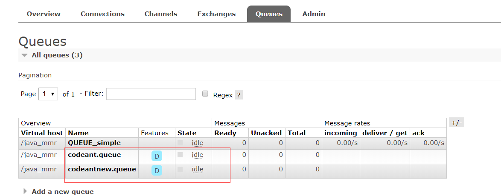
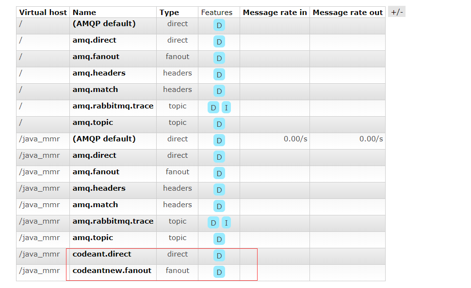
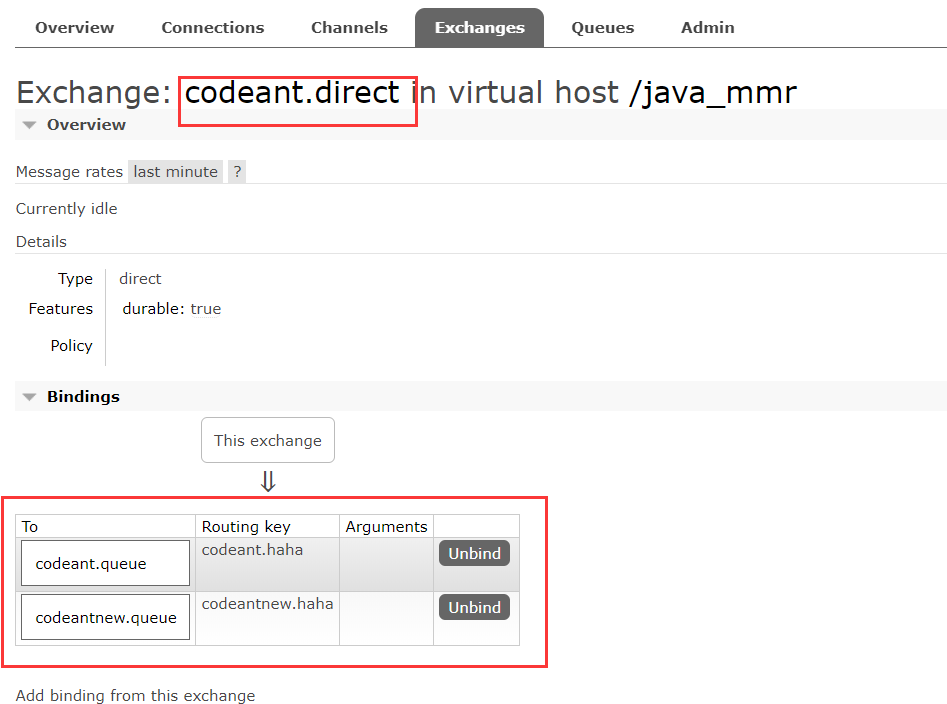
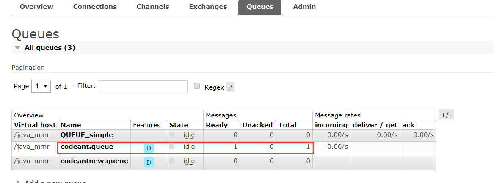
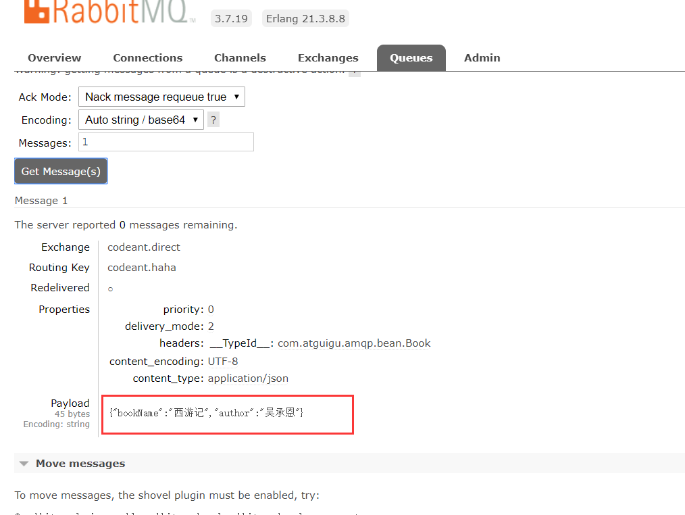
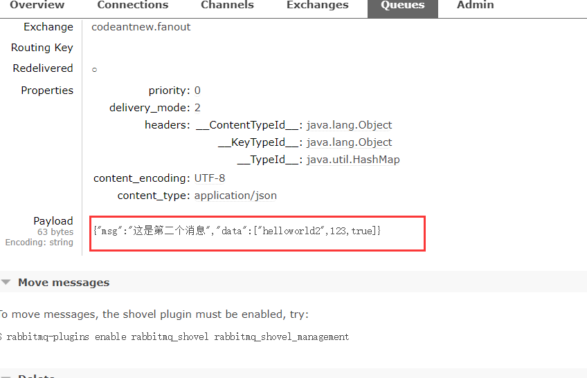
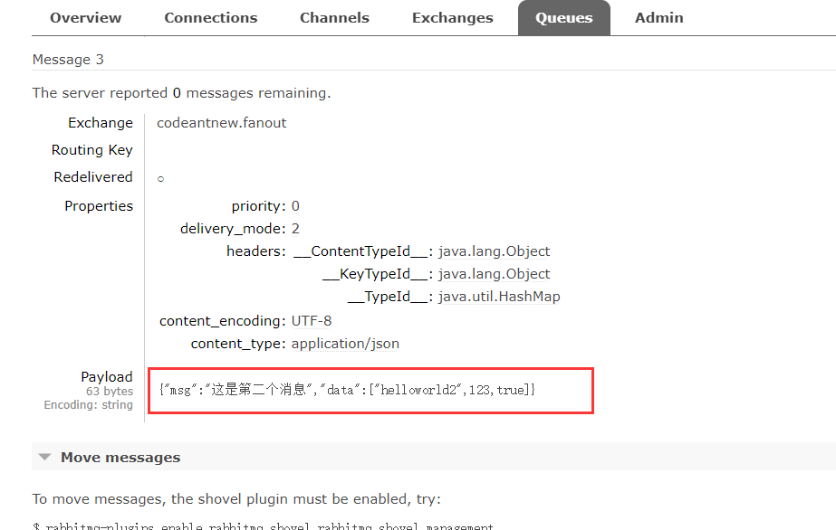
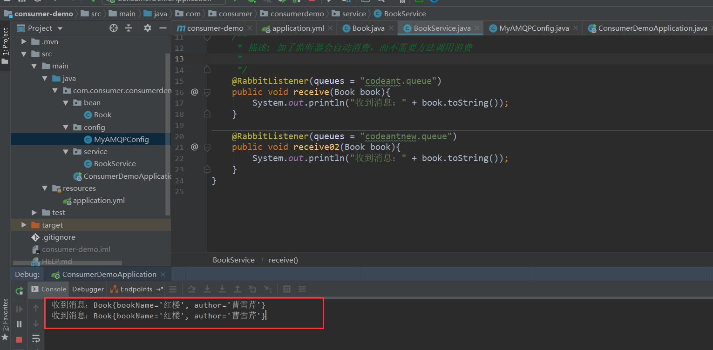

## 简述

阅读本文之前，需要安装好rabbitmq-server。

主要从三种模式开发小的demo：单播（direct）、广播（fanout）

demo地址：

## pom.xml

生产者和消费者的依赖都是一样的

```xml
<parent>
    <groupId>org.springframework.boot</groupId>
    <artifactId>spring-boot-starter-parent</artifactId>
    <version>1.5.12.RELEASE</version>
    <relativePath/> <!-- lookup parent from repository -->
</parent>

<properties>
    <project.build.sourceEncoding>UTF-8</project.build.sourceEncoding>
    <project.reporting.outputEncoding>UTF-8</project.reporting.outputEncoding>
    <java.version>1.8</java.version>
</properties>

<dependencies>
    <dependency>
        <groupId>org.springframework.boot</groupId>
        <artifactId>spring-boot-starter-amqp</artifactId>
    </dependency>
    <dependency>
        <groupId>org.springframework.boot</groupId>
        <artifactId>spring-boot-starter-web</artifactId>
    </dependency>

    <dependency>
        <groupId>org.springframework.boot</groupId>
        <artifactId>spring-boot-starter-test</artifactId>
        <scope>test</scope>
    </dependency>
</dependencies>

<build>
    <plugins>
        <plugin>
            <groupId>org.springframework.boot</groupId>
            <artifactId>spring-boot-maven-plugin</artifactId>
        </plugin>
    </plugins>
</build>
```

## 生产者

**配置消息的发送格式（这里是json）**

```java
@Configuration
public class MyAMQPConfig {

    @Bean
    public MessageConverter messageConverter(){
        return new Jackson2JsonMessageConverter();
    }
}
```

**创建exchange、queue，并绑定**

```java
/**
 * 描述：创建exchange，绑定规则
 *
 * @author LJH
 * @date 2019/10/15-15:37
 * @QQ 1755497577
 */
@RestController
public class CreateExchangeController {

    @Autowired
    AmqpAdmin amqpAdmin;

    @GetMapping("create")
    public String create(){
        createQueue();
        createDirectExchange();
        createFanoutExchange();
        return "succ";
    }

    /**
     *   创建两个exchange：codeant(单播)    codeant.new（广播）
     *
     *   创建两个queue：codeant.queue    codeantnew.queue
     *
     *  1. 创建exchange
     *  2. 创建queue
     *  3. 绑定exchange和queue
     */

    public void createQueue(){
        /*durable：是否持久化*/
        amqpAdmin.declareQueue(new Queue("codeant.queue",true));
        amqpAdmin.declareQueue(new Queue("codeantnew.queue",true));

        //删除queue
//        amqpAdmin.deleteQueue();
    }


    /*单播*/
    public void createDirectExchange(){

        //创建声明exchange，这里是DirectExchange类型
		amqpAdmin.declareExchange(new DirectExchange("codeant.direct"));
		System.out.println("codeant.direct - DirectExchange - 创建完成");

        //创建绑定规则
        amqpAdmin.declareBinding(new Binding("codeantnew.queue",
                Binding.DestinationType.QUEUE,
                "codeant.direct",
                "codeantnew.haha",
                null)
        );

        amqpAdmin.declareBinding(new Binding("codeant.queue",
                Binding.DestinationType.QUEUE,
                "codeant.direct",
                "codeant.haha",
                null)
        );

        //删除exchange
//        amqpAdmin.deleteExchange();
    }

    /*广播*/
    public void createFanoutExchange(){

        //创建声明exchange，这里是DirectExchange类型
        amqpAdmin.declareExchange(new FanoutExchange("codeantnew.fanout"));
        System.out.println("codeant.fanout - fanoutExchange - 创建完成");

        //创建绑定规则
        amqpAdmin.declareBinding(new Binding("codeantnew.queue",
                Binding.DestinationType.QUEUE,
                "codeantnew.fanout",
                "codeantnew.haha",
                null)
        );

        amqpAdmin.declareBinding(new Binding("codeant.queue",
                Binding.DestinationType.QUEUE,
                "codeantnew.fanout",
                "codeant.haha",
                null)
        );

        //删除exchange
//        amqpAdmin.deleteExchange();
    }
}
```

**Book实体类**

```java
public class Book {
    private String bookName;
    private String author;

    public Book() {}
    public Book(String bookName, String author) {this.bookName = bookName;this.author = author;}
    public String getBookName() {return bookName;}
    public void setBookName(String bookName) {this.bookName = bookName;}
    public String getAuthor() { return author;}
    public void setAuthor(String author) {this.author = author;}
    @Override
    public String toString() {
        return "Book{" +
                "bookName='" + bookName + '\'' +
                ", author='" + author + '\'' +
                '}';
    }
}
```

**生产者发送消息**

```java
/**
 * 描述：生产者
 *
 * @author LJH
 * @date 2019/10/15-15:34
 * @QQ 1755497577
 */
@RestController
public class SendController {

    @Autowired
    RabbitTemplate rabbitTemplate;

    /**
     * 描述: 单播
     *
     * 效果：在没消费者消费之前，只有路由key为codeant.haha会增加一条消息
     *
     * @author LJH-1755497577 2019/10/15 16:09
     * @param
     * @return java.lang.String
     */
    @GetMapping("sendMsgD")
    public String sendMsgD(){
        //Message需要自己构造一个;定义消息体内容和消息头
        //rabbitTemplate.send(exchage,routeKey,message);

        //object默认当成消息体，只需要传入要发送的对象，自动序列化发送给rabbitmq；
        //rabbitTemplate.convertAndSend(exchage,routeKey,object);
        Map<String,Object> map = new HashMap<>();
        map.put("msg","这是第一个消息");
        map.put("data", Arrays.asList("helloworld",123,true));
        //对象被默认序列化以后发送出去
        rabbitTemplate.convertAndSend("codeant.direct","codeant.haha",new Book("西游记","吴承恩"));
        return "succ";
     }

    /**
     * 描述: 广播
     *
     * 效果：在没消费者消费之前，所有队列都会会增加一条消息，看效果前需要注释掉启动类的@EnableRabbit
     *
     * @author LJH-1755497577 2019/10/15 16:11
     * @param
     * @return java.lang.String
     */
    @GetMapping("sendMsgF")
    public String sendMsgF(){
        //Message需要自己构造一个;定义消息体内容和消息头
        //rabbitTemplate.send(exchage,routeKey,message);

        //object默认当成消息体，只需要传入要发送的对象，自动序列化发送给rabbitmq；
        //rabbitTemplate.convertAndSend(exchage,routeKey,object);
        Map<String,Object> map = new HashMap<>();
        map.put("msg","这是第二个消息");
        map.put("data", Arrays.asList("helloworld2",123,true));
        //对象被默认序列化以后发送出去
        rabbitTemplate.convertAndSend("codeantnew.fanout",""/*广播不需要路由key*/,map);
        return "succ";
    }
}
```

### 测试

根据SendController.java中方法进行测试

#### 创建exchange、queue、绑定

**队列**



**exchange**



**绑定**



#### 单播

http://127.0.0.1:8080/sendMsgD





#### 广播

http://127.0.0.1:8080/sendMsgF







## 消费者

**服务层消费者**

```java
@Service
public class BookService {

    /**
     * 描述: 加了监听器会自动消费，而不需要方法调用消费
     *
     */
    @RabbitListener(queues = "codeant.queue")
    public void receive(Book book){
        System.out.println("收到消息：" + book.toString());
    }

    @RabbitListener(queues = "codeantnew.queue")
    public void receive02(Book book){
        System.out.println("收到消息：" + book.toString());
    }
}
```


### 测试

先通过生产者生产消息，这里采用广播方式生产（ http://127.0.0.1:8080/sendMsgF ），然后启动消费者消费消息，启动会不需要调用，添加@RabbitListener注解后会自动监听队列



