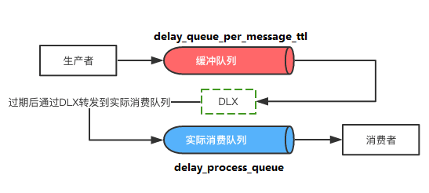
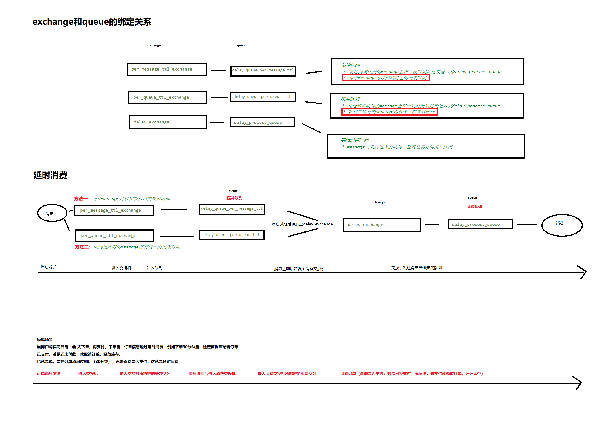

## 背景

何为延迟队列？

顾名思义，延迟队列就是进入该队列的消息会被延迟消费的队列。而一般的队列，消息一旦入队了之后就会被消费者马上消费。

场景一：在订单系统中，一个用户下单之后通常有30分钟的时间进行支付，如果30分钟之内没有支付成功，那么这个订单将进行一场处理。这是就可以使用延时队列将订单信息发送到延时队列。

场景二：用户希望通过手机远程遥控家里的智能设备在指定的时间进行工作。这时候就可以将用户指令发送到延时队列，当指令设定的时间到了再将指令推送到只能设备。

## 延迟队列能做什么？

延迟队列多用于需要延迟工作的场景。最常见的是以下两种场景：

1、**延迟消费**。比如：

1. 用户生成订单之后，需要过一段时间校验订单的支付状态，如果订单仍未支付则需要及时地关闭订单。
2. 用户注册成功之后，需要过一段时间比如一周后校验用户的使用情况，如果发现用户活跃度较低，则发送邮件或者短信来提醒用户使用。

2、**延迟重试**。比如消费者从队列里消费消息时失败了，但是想要延迟一段时间后自动重试。

如果不使用延迟队列，那么我们只能通过一个轮询扫描程序去完成。这种方案既不优雅，也不方便做成统一的服务便于开发人员使用。但是使用延迟队列的话，我们就可以轻而易举地完成。

## 如何实现？-----------

别急，在下文中，我们将详细介绍如何利用Spring Boot加RabbitMQ来实现延迟队列。

本文出现的示例代码都已push到Github仓库中：https://github.com/Lovelcp/blog-demos/tree/master/spring-boot-rabbitmq-delay-queue

## 实现思路

在介绍具体的实现思路之前，我们先来介绍一下RabbitMQ的两个特性，一个是Time-To-Live Extensions，另一个是Dead Letter Exchanges。

**Time-To-Live Extensions**

RabbitMQ允许我们为消息或者队列设置TTL（time to live），也就是过期时间。TTL表明了一条消息可在队列中存活的最大时间，单位为毫秒。也就是说，当某条消息被设置了TTL或者当某条消息进入了设置了TTL的队列时，这条消息会在经过TTL秒后“死亡”，成为Dead Letter。如果既配置了消息的TTL，又配置了队列的TTL，那么较小的那个值会被取用。更多资料请查阅官方文档。

**Dead Letter Exchange**

刚才提到了，被设置了TTL的消息在过期后会成为Dead Letter。其实在RabbitMQ中，一共有三种消息的“死亡”形式：

1. 消息被拒绝。通过调用basic.reject或者basic.nack并且设置的requeue参数为false。
2. 消息因为设置了TTL而过期。
3. 消息进入了一条已经达到最大长度的队列。

如果队列设置了Dead Letter Exchange（DLX），那么这些Dead Letter就会被重新publish到Dead Letter Exchange，通过Dead Letter Exchange路由到其他队列。更多资料请查阅官方文档。

## 流程图

聪明的你肯定已经想到了，如何将RabbitMQ的TTL和DLX特性结合在一起，实现一个延迟队列。

针对于上述的延迟队列的两个场景，我们分别有以下两种流程图：

**延迟消费**

延迟消费是延迟队列最为常用的使用模式。如下图所示，生产者产生的消息首先会进入缓冲队列（图中红色队列）。通过RabbitMQ提供的TTL扩展，这些消息会被设置过期时间，也就是延迟消费的时间。等消息过期之后，这些消息会通过配置好的DLX转发到实际消费队列（图中蓝色队列），以此达到延迟消费的效果。
 



## 代码实现流程

- 创建queue、exchange、绑定路由规则 -- QueueConfig.java
- 设置队列消息的过期时间 -- ExpirationMessagePostProcessor.java
- 发送消息到exchange -- ApplicationTests.java下的testDelayQueuePerMessageTTL()方法
- 从exchange接收消息 -- ProcessReceiver.java

**具体代码请参考：**

**编写测试用例**

**延迟消费场景**

首先我们编写用于测试TTL设置在消息上的测试代码。

我们借助spring-rabbit包下提供的RabbitTemplate类来发送消息。由于我们添加了spring-boot-starter-amqp扩展，Spring Boot会在初始化时自动地将RabbitTemplate当成bean加载到容器中。

解决了消息的发送问题，那么又该如何为每个消息设置TTL呢？这里我们需要借助MessagePostProcessor。MessagePostProcessor通常用来设置消息的Header以及消息的属性。我们新建一个ExpirationMessagePostProcessor类来负责设置消息的TTL属性： 

[?](https://www.jb51.net/article/128702.htm#)

```
`/**`` ``* 设置消息的失效时间`` ``*/``public` `class` `ExpirationMessagePostProcessor ``implements` `MessagePostProcessor {`` ``private` `final` `Long ttl; ``// 毫秒`` ``public` `ExpirationMessagePostProcessor(Long ttl) {``  ``this``.ttl = ttl;`` ``}`` ``@Override`` ``public` `Message postProcessMessage(Message message) ``throws` `AmqpException {``  ``message.getMessageProperties()``    ``.setExpiration(ttl.toString()); ``// 设置per-message的失效时间``  ``return` `message;`` ``}``}`
```

然后在调用RabbitTemplate的convertAndSend方法时，传入ExpirationMessagePostPorcessor即可。我们向缓冲队列中发送3条消息，过期时间依次为1秒，2秒和3秒。具体的代码如下所示：

[?](https://www.jb51.net/article/128702.htm#)

```
`@Test``public` `void` `testDelayQueuePerMessageTTL() ``throws` `InterruptedException {`` ``ProcessReceiver.latch = ``new` `CountDownLatch(``3``);`` ``for` `(``int` `i = ``1``; i <= ``3``; i++) {``  ``long` `expiration = i * ``1000``;``  ``rabbitTemplate.convertAndSend(QueueConfig.DELAY_QUEUE_PER_MESSAGE_TTL_NAME,``    ``(Object) (``"Message From delay_queue_per_message_ttl with expiration "` `+ expiration), ``new` `ExpirationMessagePostProcessor(expiration));`` ``}`` ``ProcessReceiver.latch.await();``}`
```

细心的朋友一定会问，为什么要在代码中加一个CountDownLatch呢？这是因为如果没有latch阻塞住测试方法的话，测试用例会直接结束，程序退出，我们就看不到消息被延迟消费的表现了。

那么类似地，测试TTL设置在队列上的代码如下：

[?](https://www.jb51.net/article/128702.htm#)

```
`@Test``public` `void` `testDelayQueuePerQueueTTL() ``throws` `InterruptedException {`` ``ProcessReceiver.latch = ``new` `CountDownLatch(``3``);`` ``for` `(``int` `i = ``1``; i <= ``3``; i++) {``  ``rabbitTemplate.convertAndSend(QueueConfig.DELAY_QUEUE_PER_QUEUE_TTL_NAME,``    ``"Message From delay_queue_per_queue_ttl with expiration "` `+ QueueConfig.QUEUE_EXPIRATION);`` ``}`` ``ProcessReceiver.latch.await();``}`
```

我们向缓冲队列中发送3条消息。理论上这3条消息会在4秒后同时过期。

**延迟重试场景**

我们同样还需测试延迟重试场景。

[?](https://www.jb51.net/article/128702.htm#)

```
`@Test``public` `void` `testFailMessage() ``throws` `InterruptedException {`` ``ProcessReceiver.latch = ``new` `CountDownLatch(``6``);`` ``for` `(``int` `i = ``1``; i <= ``3``; i++) {``  ``rabbitTemplate.convertAndSend(QueueConfig.DELAY_PROCESS_QUEUE_NAME, ProcessReceiver.FAIL_MESSAGE);`` ``}`` ``ProcessReceiver.latch.await();``}`
```

我们向delay_process_queue发送3条会触发FAIL的消息，理论上这3条消息会在4秒后自动重试。

**查看测试结果**

**延迟消费场景**

延迟消费的场景测试我们分为了TTL设置在消息上和TTL设置在队列上两种。首先，我们先看一下TTL设置在消息上的测试结果：

[](https://files.jb51.net/file_images/article/201711/2017112111255062.gif)

从上图中我们可以看到，ProcessReceiver分别经过1秒、2秒、3秒收到消息。测试结果表明消息不仅被延迟消费了，而且每条消息的延迟时间是可以被个性化设置的。TTL设置在消息上的延迟消费场景测试成功。

然后，TTL设置在队列上的测试结果如下图：

[](https://files.jb51.net/file_images/article/201711/2017112111255063.gif) 

从上图中我们可以看到，ProcessReceiver经过了4秒的延迟之后，同时收到了3条消息。测试结果表明消息不仅被延迟消费了，同时也证明了当TTL设置在队列上的时候，消息的过期时间是固定的。TTL设置在队列上的延迟消费场景测试成功。

延迟重试场景

接下来，我们再来看一下延迟重试的测试结果：

[](https://files.jb51.net/file_images/article/201711/2017112111255064.gif) 

ProcessReceiver首先收到了3条会触发FAIL的消息，然后将其移动到缓冲队列之后，过了4秒，又收到了刚才的那3条消息。延迟重试场景测试成功。

## 参考

 https://www.jb51.net/article/128702.htm 	Spring Boot与RabbitMQ结合实现延迟队列的示例

本文首先介绍了延迟队列的概念以及用途，并且通过代码详细讲解了如何通过Spring Boot和RabbitMQ实现一个延迟队列。希望本文能够对大家平时的学习和工作能有所启发和帮助。也希望大家多多支持脚本之家。

